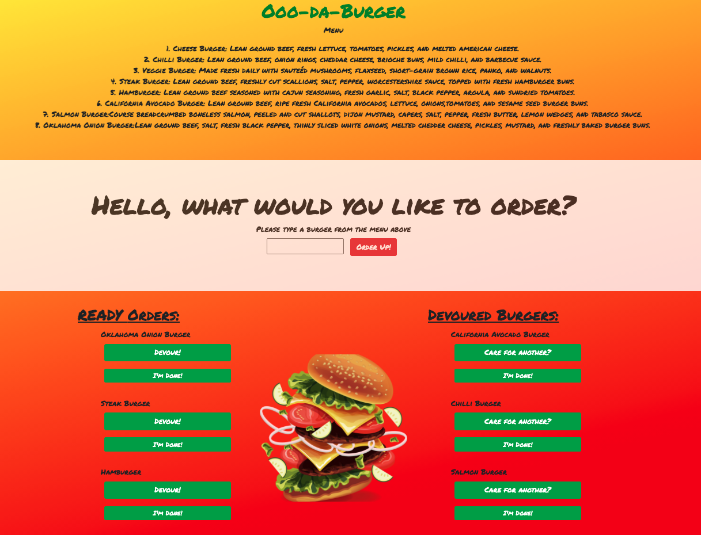

# Burger [](https://opensource.org/licenses/MIT)

## Description

I created a full-stack burger devouring application with a homemade ORM. Together, it can log a user's request of their choice of deliciousness or maybe have another burger per their request. By following the MVC design pattern, I was able to query and route data in this application, AND used Handlebars to generate my html. When a user orders a burger, it gets displayed in the Ready Orders column and stored into the database. When you are ready to eat it, click devour. Once devoured, that burger gets placed in the devoured burgers column. The user then has the choice of ordering another one of that type of burger, ordering an entirely new burger type by inputting their burger name above OR clicking i'm done. This suggests that the user is no longer hungry and does not want another burger which then gets deleted. With a unique id for each burger, we can ensure a system that tracks the statistics of requested and eaten burgers for users or consumers.

## User Story
```
As a user,
I want to be able to add the type of burger I want to order from the menu, devour it, order another burger per my request as many as I would like, and get rid of (or delete) all the eaten evidence after I am done 
So that I can order, eat as much as I want, and go about my working day happily feed, full, and ready to tackle the rest of my day.
```

## Table of Contents
* [Description](#description)
* [Installation](#installation)
* [Usage](#usage)
* [License](#license)
* [Contributing](#contributing)
* [Tests](#tests)
* [Criteria](#criteria)
* [Application](#application)
* [Questions](#questions)

## Installation 

In order to install these dependencies, 

Run the following command in the terminal in any order AFTER the first numbered list item:

1. npm i 
2. npm install mysql
3. npm install express
4. npm install express-handlebars


## Usage
 
* ES6
* MYSQL
* Dotenv
* Express
* Terminal
* Handlebars
* Javascript
* ORM (Object Relational Mapper)
* Node Package Manager: Inquirer

## License

* MIT

## Contributing 

N/A

## Tests

To run test, run the following commands:

```
* npm start OR
* node server.js 
```

## Criteria
```
- A functional application deployed to Heroku.

- Updated Portfolio with this Burger application.
```

## Application



* [Burger App](https://immense-lake-44688.herokuapp.com/)

## Questions

* If you have any questions regarding this repository, contact me either by email at Samyaf020@gmail.com, or you can find more of my work within my github account attached here [Github](https://github.com/Samya129). Here, you can also open an issue if needed.
